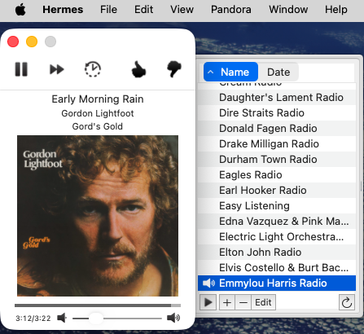

Hermes (Apple Silicon)
======================

A work-alike version of the original [Hermes](https://github.com/HermesApp/Hermes) [Pandora](http://www.pandora.com/) client, modified for Apple Silicon and modern macOS.



The original Hermes project is unmaintained. This fork updates it to build and run natively on Apple Silicon (arm64) Macs running macOS 12.0+.

### Changes from the original

- **Apple Silicon native** — arm64 only, no Rosetta required
- **macOS 12.0+ target** — builds and runs on modern macOS
- **Removed Sparkle.framework** — auto-update framework removed (unmaintained upstream)
- **Removed Growl.framework** — replaced with native NSUserNotificationCenter
- **Fixed deprecated API warnings** — updated or suppressed deprecated calls
- **Fixed window restoration crash** — ad-hoc signed builds no longer crash on launch
- **Modern toolbar layout** — all toolbar items visible using expanded toolbar style
- **Enhanced like indicator** — thumbs-up icon tints blue when a song is liked

### Building

Requires Xcode with arm64 support.

```bash
xcodebuild -project Hermes.xcodeproj -scheme Hermes -configuration Release \
  -arch arm64 ONLY_ACTIVE_ARCH=NO \
  CODE_SIGN_IDENTITY="-" CODE_SIGNING_REQUIRED=NO build
```

The built app will be in `~/Library/Developer/Xcode/DerivedData/Hermes-*/Build/Products/Release/Hermes.app`.

### Develop against Hermes

Thanks to the suggestions by [blalor](https://github.com/blalor), there's a few
ways you can develop against Hermes if you really want to.

1. `NSDistributedNotificationCenter` - Every time a new song plays, a
   notification is posted with the name `hermes.song` under the object `hermes`
   with `userInfo` as a dictionary representing the song being played. See
   [Song.m](Sources/Pandora/Song.m)
   for the keys available to you.

2. AppleScript - here's an example script:

        tell application "Hermes"
          play          -- resumes playback, does nothing if playing
          pause         -- pauses playback, does nothing if not playing
          playpause     -- toggles playback between pause/play
          next song     -- goes to the next song
          get playback state
          set playback state to playing

          thumbs up     -- likes the current song
          thumbs down   -- dislikes the current song, going to another one
          tired of song -- sets the current song as being "tired of"

          raise volume  -- raises the volume partially
          lower volume  -- lowers the volume partially
          full volume   -- raises volume to max
          mute          -- mutes the volume
          unmute        -- unmutes the volume to the last state from mute

          -- integer 0 to 100 for the volume
          get playback volume
          set playback volume to 92

          -- Working with the current station
          set stationName to the current station's name
          set stationId to station 2's stationId
          set the current station to station 4

          -- Getting information from the current song
          set title to the current song's title
          set artist to the current song's artist
          set album to the current song's album
          ... etc
        end tell

## License

Code is available under the [MIT License](LICENSE).

Based on the original [Hermes](https://github.com/HermesApp/Hermes) by Alex Crichton, Nicholas Riley, and Winston Weinert.
